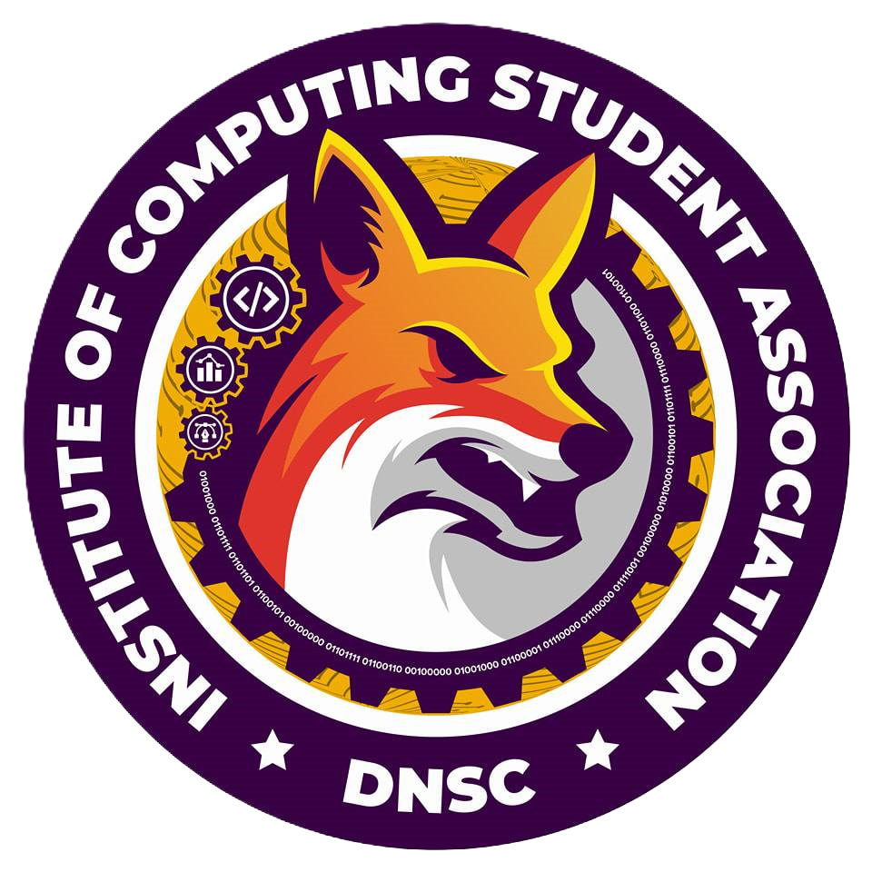

<p align="center">
  
</p>

<h1 align="center">ICSA Collection Management System</h1>
<p align="center">
  
</p>

<h1 align="center">ICSA Collection Management System (ICSA CMS)</h1>

---

## 📖 About ICSA CMS

The **ICSA Collection Management System (ICSA CMS)** is a web-based platform designed to streamline, automate, and secure the collection management workflow of the Institute of Computing Student Association (ICSA).

It centralizes student contributions, payment tracking, and reporting into a single system—reducing manual work, improving transparency, and enabling better financial oversight across institutes.

The system is built with **scalability and access control** in mind, supporting multiple user roles with clearly defined permissions.

---

## ✨ Key Features

### 🔐 Authentication & Authorization

* Secure authentication system
* **Group-based, role-driven permissions**
* Fine-grained access control per module and action

### 👥 User Roles & Permissions

* **Super Admin**

  * Full system access
  * Manage all data, users, institutes, and configurations

* **School Admin**

  * Manage multiple institutes under a school
  * Oversee collections, reports, and institute admins

* **Institute Admin**

  * Manage institute-level data
  * Handle operations restricted from institute staff

* **Institute Staff**

  * Perform daily collection-related tasks
  * Limited access based on assigned permissions

* **Students**

  * View personal payment records and contribution history
  * Read-only access to relevant data

---

### 💰 Collection Management

* Track student contributions and fees
* Support for multiple fee categories
* Detailed transaction records and audit logs
* Status-based payment tracking

---

### 🔗 System Integrations

ICSA CMS integrates with multiple internal school systems to ensure consistent, real-time data across platforms:

* **Locker Management System** – Fee validation and subscription linkage
* **Attendance System** – Enrollment and eligibility verification
* **Voting System** – Automatic voter eligibility checks
* **Student Portal** – Centralized student information and payment visibility

This allows ICSA CMS to function as a **central financial and validation hub** within the school ecosystem.

---

## 🛠️ Tech Stack

### Frontend

* **Vue 3** – Progressive JavaScript framework
* **TypeScript** – Type-safe frontend development
* **TailwindCSS** – Utility-first styling for responsive UI
* **Vite** – Fast development and build tooling

### Backend

* **Django** – High-level Python web framework
* **Django REST Framework (DRF)** – RESTful API development
* **Django Permissions & Groups** – Role-based access control

### Database

* **PostgreSQL / MySQL** – Relational database for reliable data storage

---

## 🚀 Getting Started

### Prerequisites

Ensure you have the following installed:

* Node.js 18+ and npm
* Git

---

## ⚙️ Installation (Frontend Only)

### 1. Clone the repository

```bash
git clone https://github.com/Etriii/collection_management_system.git
cd collection_management_system
```

---
### 2. Frontend Setup (Vue)

```bash
npm install
npm run dev
```

---

## 🌐 Accessing the Application

* Frontend: `http://localhost:5173`

* Backend API: Configured and deployed separately

* Frontend: `http://localhost:5173`

* Backend API: `http://localhost:8000`

---

## 📊 Project Analytics


## 🙏 Acknowledgments

Special thanks to the **Institute of Computing Student Association (ICSA)** for their support and collaboration.

Shoutout to **Sir Arki** for guidance and mentorship.

Built with ❤️ by the **Codex Programming Club**.